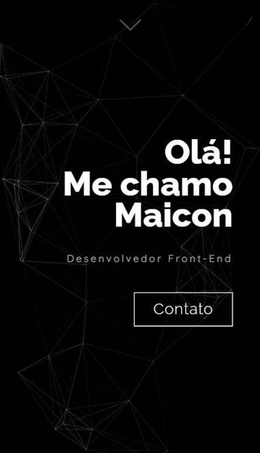
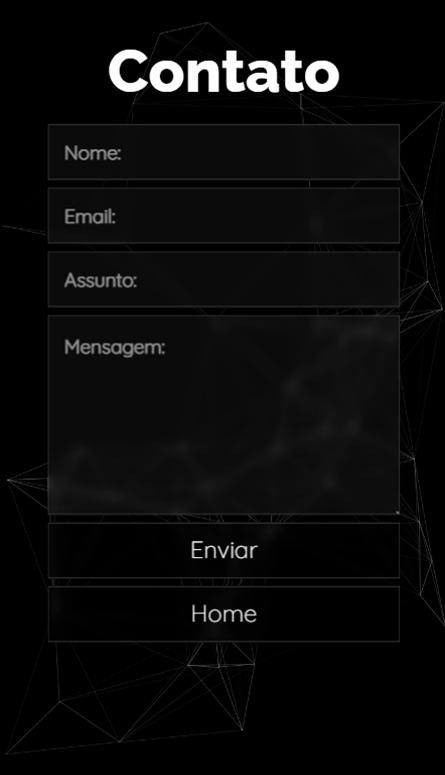

# Portfólio - Maicon da Silva - Desenvolvedor Front-End

## Sobre o projeto

O projeto em questão se trata de um portfólio em formato de WebSite, com o objetivo de apresentar meu trabalho como desenvolvedor Front-End, contendo alguns projetos desenvolvidos, experiências profissionais e habilidades na área da tecnologia. 

É possível acessar a página a partir do botão a seguir.

## Layout Mobile

## Layout Desktop

## Tecnologias utilizadas

### Front-End
- HTML
- CSS
- JavaScript
- Bootstrap
### Ferramentas Externas
-ScrollRevealjs.org
-FormSubmit.co

## Autor

Maicon de Oliveira da Silva
